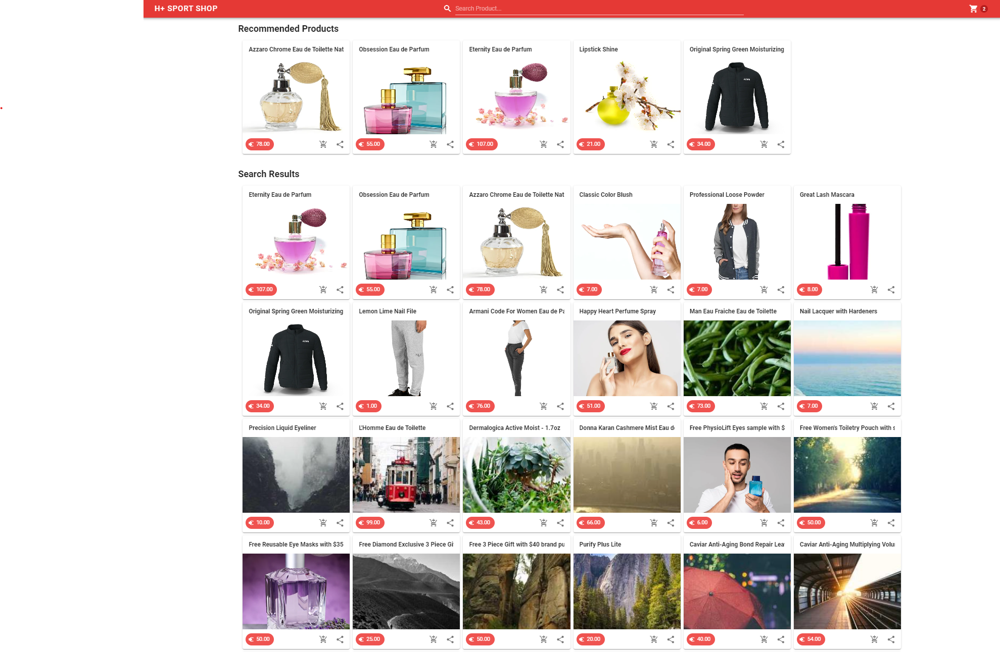

# Sitecore Discover Vue.js Store
Vue.JS application that implements widgets from Discover (Search and recommendations)

https://miguelminoldo.fr/2023/07/12/intro-sitecore-discover-part-1/

## Created with
1. Vue.JS
2. Vuetify
3. Sitecore Discover

## Demo Link
https://discover-vue.vercel.app/#/

## Installation
1. `git clone https://github.com/MiguelMinoldo/DiscoverVue.git`
2. `cd DiscoverVue`
3. `yarn` or `npm install`
4. `yarn serve` or `npm run serve`
5. go to `http://localhost:8080`

# Credits and original repo
https://vuejsexamples.com/vue-application-that-shows-products-from-hplussport-api/
https://github.com/best-lucky1030/Hplus-Sport-Shop?ref=vuejsexamples.com